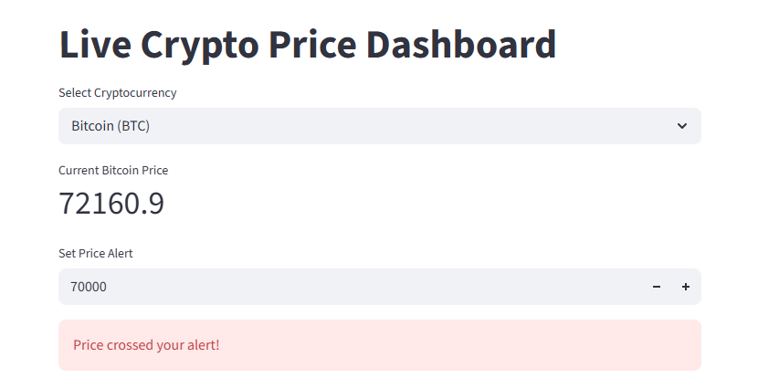
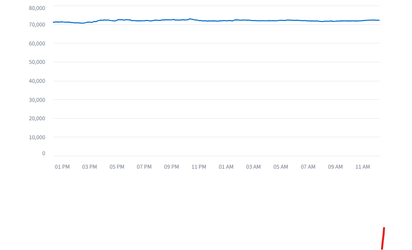

# 📊 Crypto Price Analyzer & Dashboard

A Python-based cryptocurrency analysis project that fetches real-time market data, performs data analysis, and visualizes price trends through an interactive dashboard.

This project demonstrates API integration, data processing, and data visualization using modern Python tools.

---

## 🚀 Features

- Fetch live cryptocurrency data from the CoinGecko API
- Analyze price statistics (average, maximum, minimum)
- Calculate price change and percentage change
- Interactive data visualization
- Multi-coin selection (Bitcoin, Ethereum, Litecoin)
- Price alert system
- Real-time dashboard using Streamlit

---

## 🛠 Tech Stack

- Python
- Pandas
- Requests
- Streamlit
- Matplotlib
- CoinGecko API

---

## 📊 Data Source

Cryptocurrency market data is fetched from the CoinGecko API.

---

## ⚙ Installation

Clone the repository:

```bash
git clone https://github.com/amisha-donga/crypto-price-analyzer.git
cd crypto-price-analyzer

Install dependencies:

pip install -r requirements.txt

## ▶ Running the Project

Follow these steps to run the project locally.

### 1️⃣ Install Dependencies

Install the required Python libraries:

pip install -r requirements.txt


### 2️⃣ Fetch Cryptocurrency Data

Run the script to fetch cryptocurrency price data from the API:

python src/fetch.py


### 3️⃣ Analyze the Data

Run the analysis script to calculate statistics such as average price and price change:

python src/analyze.py


### 4️⃣ Run the Dashboard

Start the interactive dashboard:

streamlit run src/dashboard.py


The dashboard will open in your browser where you can view cryptocurrency price trends and alerts.


📈 Dashboard Features

The dashboard provides:

Live cryptocurrency price
Interactive price charts
Multi-coin selection
Price alert system


📌 Future Improvements

Multi-timeframe analysis
Cryptocurrency comparison charts
Email price alerts
Deployment to cloud platforms


* Amisha Donga
* Aspiring Data Analyst

---

### Technologies Used

- Python
- Pandas
- Requests
- Streamlit
- CoinGecko API
- Data Analysis Concepts


---

## 📸 Dashboard Preview

- Below is the interactive cryptocurrency dashboard built using Streamlit.



